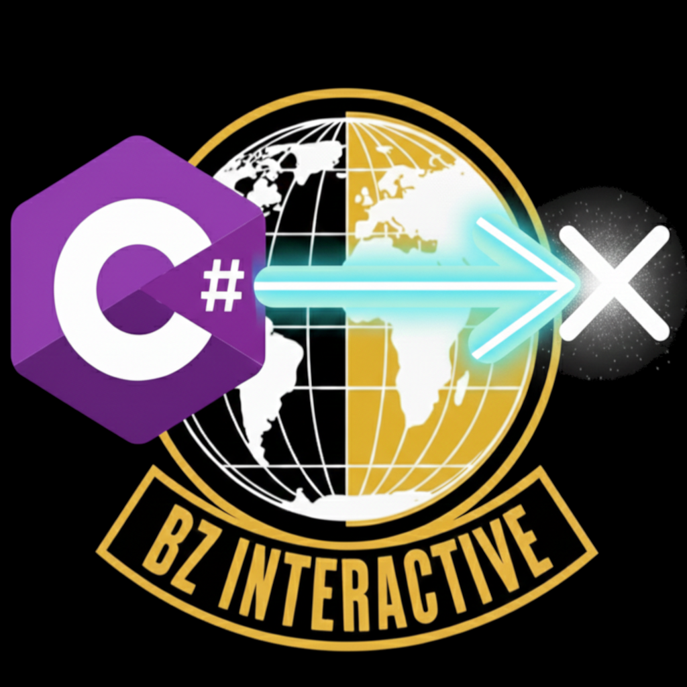

<br />
<div align="center">
  <table>
    <tr>
      <td valign="middle" style="padding-right:10px">
        <a href="https://github.com/BZ-Interactive/BZ-Godot-Physics">
          
        </a>
      </td>
      <td valign="middle" style="text-align:left; max-width:600px">
        <h3 style="margin:0">BZ Godot Physics</h3>
        <p style="margin-top:8px; margin-bottom:8px; text-align:left">
          A lightweight, high-performance C# physics helper for Godot 4+. Provides easy-to-use extension methods for 3D raycasts and linecasts, a tidy <code>CastHit</code> result struct, and a simple collision mask helper.
        </p>
        <p style="margin:10px 10; text-align:left">
          
          
          
        </p>
        <p style="margin:0; text-align:left">
          <a href="https://github.com/BZ-Interactive/BZ-Godot-Physics"><strong>Explore the repo »</strong></a>
          &nbsp;&nbsp;|&nbsp;&nbsp;
          <a href="https://github.com/BZ-Interactive/BZ-Godot-Physics/releases">See Releases</a>
          &nbsp;·&nbsp;
          <a href="https://github.com/BZ-Interactive/BZ-Godot-Physics/issues">Request Feature</a>
          &nbsp;·&nbsp;
          <a href="https://github.com/BZ-Interactive/BZ-Godot-Physics/issues">Report Bug</a>
        </p>
        </p>
      </td>
    </tr>
  </table>
</div>

## ✨ Features

### 🎯 Easy Raycasting
- Extension methods for `Node3D` to perform raycasts and line casts
- Clean, intuitive API that integrates seamlessly with your existing code

### 📦 Structured Results
- `CastHit` readonly struct provides clean access to hit data
- Hit position, surface normal, collider reference, and more

### 🎭 Collision Masks
- Simple helper method to generate collision layer masks
- Uses 1-based layer numbers for intuitive usage

### ⚡ Lightweight
- Minimal footprint addon
- Pure Godot 4+ C# code

## 📋 Requirements

- Godot 4.0 or later
- .NET-enabled Godot build
- Basic C# knowledge

## 📦 Installation

### From Asset Library
1. Search for "BZ Godot Physics" in the Godot Asset Library
2. Click Install and enable the plugin in **Project → Project Settings → Plugins**

### Manual Installation
1. Download or clone this repository
2. Copy the `addons/BZPhysicsHelper` folder into your project's `addons/` directory
3. Enable the plugin in **Project → Project Settings → Plugins**
4. Add `using BZ.Physics;` to your scripts

## 🚀 Quick Start

### Cast a Ray

```csharp
using BZ.Physics;

// Cast a ray from a position in a direction
CastHit hit = this.CastRay3D(
    from: GlobalPosition,
    direction: -GlobalBasis.Y,
    distance: 100f,
    layerMask: PhysicsHelper.GetCollisionMask(1, 2, 3)
);

if (hit.NonEmpty)
{
    GD.Print($"Hit {hit.ColliderOwnerName} at {hit.HitPosition}");
}
```

### Cast a Line Between Two Points

```csharp
CastHit lineHit = this.CastLine3D(
    from: startPoint,
    to: endPoint,
    collideWithAreas: true
);
```

### Generate Collision Masks

```csharp
// Create a mask for layers 1, 3, and 5
uint mask = PhysicsHelper.GetCollisionMask(1, 3, 5);
```

> **Note**: Methods are available as extensions on any `Node3D`. Ensure you have `using BZ.Physics;` at the top of your script.

## 📋 API Reference

### CastHit Struct

A readonly struct containing raycast intersection data.

| Property | Type | Description |
|----------|------|-------------|
| `NonEmpty` | `bool` | `true` if the cast hit something, `false` otherwise |
| `HitPosition` | `Vector3` | The world-space position of the intersection point |
| `Normal` | `Vector3` | The surface normal at the hit point |
| `Collider` | `CollisionObject3D` | The collider that was hit |
| `ColliderId` | `uint` | The instance ID of the collider |
| `Rid` | `Rid` | The low-level resource ID of the collider |
| `ColliderOwnerName` | `string` | The name of the collider node |

### PhysicsHelper Methods

#### CastRay3D

```csharp
CastHit CastRay3D(this Node3D sender, Vector3 from, Vector3 direction, float distance, uint layerMask = uint.MaxValue, bool collideWithAreas = false)
```

Performs a 3D raycast from a starting point in a specific direction for a set distance.

**Parameters:**
- `from` - The starting point of the ray in global space
- `direction` - The direction vector for the ray
- `distance` - The maximum distance the ray should travel
- `layerMask` - The collision mask to check against (defaults to all layers)
- `collideWithAreas` - If true, the ray will detect Area3D nodes as well

#### CastLine3D

```csharp
CastHit CastLine3D(this Node3D sender, Vector3 from, Vector3 to, uint layerMask = uint.MaxValue, bool collideWithAreas = false)
```

Performs a 3D line cast between two specific points in global space.

**Parameters:**
- `from` - The starting point of the line in global space
- `to` - The ending point of the line in global space
- `layerMask` - The collision mask to check against (defaults to all layers)
- `collideWithAreas` - If true, the ray will detect Area3D nodes in addition to bodies

#### GetCollisionMask

```csharp
uint GetCollisionMask(params uint[] layers)
```

Generates a collision mask bitfield by combining the specified physics layer numbers.

**Parameters:**
- `layers` - An array of 1-based layer numbers to include in the resulting mask

## 📂 Project Structure

```
BZ-Godot-Physics/
├── addons/
│   └── BZPhysicsHelper/
│       ├── PhysicsHelper.cs    # Main utility file with extension methods
│       ├── PluginMain.cs       # Plugin entry point
│       └── plugin.cfg          # Plugin configuration
├── LICENSE                     # MIT License
└── README.md                   # This file
```

## 💡 Example Use Cases

- **Ground Detection**: Cast rays downward to check if a character is grounded
- **Line of Sight**: Cast lines between objects to check visibility
- **Projectile Systems**: Use raycasts for hitscan weapons
- **Obstacle Detection**: Check for obstacles in a character's path

## 📝 License

This project is licensed under the [MIT License](LICENSE). See the LICENSE file for details.

## 🤝 Contributing

Contributions are welcome! Feel free to:

- Report bugs via [Issues](https://github.com/BZ-Interactive/BZ-Godot-Physics/issues)
- Submit feature requests
- Create pull requests

## 📬 Contact

[](mailto:barkin.zorlu.bz@gmail.com)

[](https://github.com/ZorluBarkin)
[](https://www.linkedin.com/in/barkin-zorlu)

## ⚠️ Notes

- This addon is for **3D physics only**
- Uses C# - .NET-enabled Godot builds required
- Layer numbers are **1-based** (matching Godot's editor UI)
- Remember to enable the plugin after installation

---

Made with ❤️ for the Godot Community

